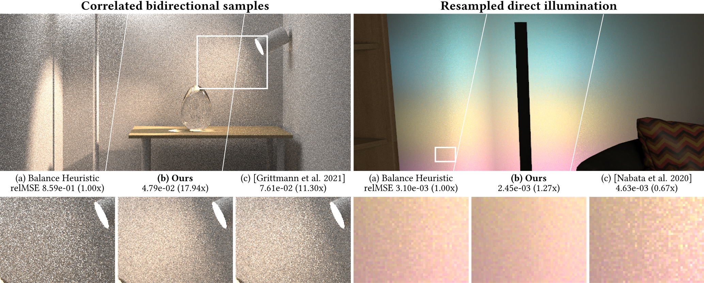

# Correct your balance heuristic: Optimizing balance-style multiple importance sampling weights



A reference implementaion of the paper ["Correct your balance heuristic: Optimizing balance-style multiple importance sampling weights"](https://graphics.cg.uni-saarland.de/publications/hua-2025-sig-correct-balance.html) by [Qingqin Hua](https://graphics.cg.uni-saarland.de/people/hua.html),  [Pascal Grittmann](https://graphics.cg.uni-saarland.de/people/grittmann.html) and [Philipp Slusallek](https://graphics.cg.uni-saarland.de/people/slusallek.html), SIGGRAPH 2025.

The implementaion contains implementation of our VCM application and RIS application. 

## Dependencies
The project is based on [SeeSharp](https://github.com/pgrit/SeeSharp) (included in this repo under SeeSharp folder) and [.NET](https://dotnet.microsoft.com/download)

## Running
Simply run 
```
cd VCM  or RIS
dotnet run -c Release
```
The code generates equal-time comparisons for both VCM and RIS, along with HTML result pages for easy preview of the results. You can view the results under `VCM\Results\` and `RIS\Results\`.

We tested our code on Windows (Visual Studio 2022 Win64). It should be runnable on x86-64 Windows, Linux, and macOS by easily run the same commands above. Please follow [SeeSharp](https://github.com/pgrit/SeeSharp) for detailed compliation instructions.

## Media

### Fast Forward Video
https://github.com/user-attachments/assets/bc3f039b-cabe-42e9-8e68-f35cac4a2c3f


